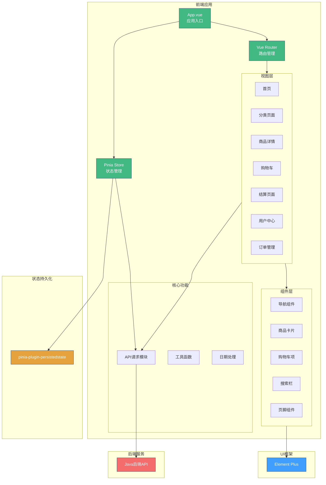

# st-vue3xiaotuxian

Vue3小兔鲜电商项目

## 系统架构

```mermaid
graph TB
    subgraph Frontend["前端应用"]
        App[App.vue<br/>应用入口]
        Router[Vue Router<br/>路由管理]
        Store[Pinia Store<br/>状态管理]
        
        subgraph Views["视图层"]
            Home[首页]
            Category[分类页面]
            ProductDetail[商品详情]
            Cart[购物车]
            Checkout[结算页面]
            UserCenter[用户中心]
            Order[订单管理]
        end
        
        subgraph Components["组件层"]
            Navigation[导航组件]
            ProductCard[商品卡片]
            CartItem[购物车项]
            SearchBar[搜索栏]
            Footer[页脚组件]
        end
        
        subgraph Core["核心功能"]
            API[API请求模块]
            Utils[工具函数]
            DayJS[日期处理]
        end
    end
    
    subgraph UI["UI框架"]
        ElementPlus[Element Plus]
    end
    
    subgraph State["状态持久化"]
        PersistedState[pinia-plugin-persistedstate]
    end
    
    subgraph Backend["后端服务"]
        JavaAPI[Java后端API]
    end
    
    App --> Router
    App --> Store
    Router --> Views
    Views --> Components
    Views --> API
    Store --> API
    Store --> PersistedState
    Components --> ElementPlus
    API --> JavaAPI
    
    classDef frontendStyle fill:#42b983,stroke:#35495e,color:#fff
    classDef uiStyle fill:#409eff,stroke:#35495e,color:#fff
    classDef stateStyle fill:#e6a23c,stroke:#35495e,color:#fff
    classDef backendStyle fill:#f56c6c,stroke:#35495e,color:#fff
    
    class App,Router,Store frontendStyle
    class ElementPlus uiStyle
    class PersistedState stateStyle
    class JavaAPI backendStyle
```